# MicroBlaze with DDR RAM on Arty A7

This tutorial describes how to do a HW design of [MicroBlaze Soft Processor](https://www.xilinx.com/products/design-tools/microblaze.html) using DDR3 RAM on the [Digilent Arty A7](https://digilent.com/reference/programmable-logic/arty-a7/start) FPGA development board in Vivado 2023.1.

## Memory Interface Generator configuration and connections

Start Vivado 2023.1. Click Create Project. Click Next.  
Enter the project name and directory. Click Next.  
Select "RTL Project" and "Do not specify sources at this time". Click Next.

Select Arty A7-100 or -35 board based on the board you are using. The steps in this tutorial are exactly the same for both models. By selecting the board, we will use the board file provided by Digilent.

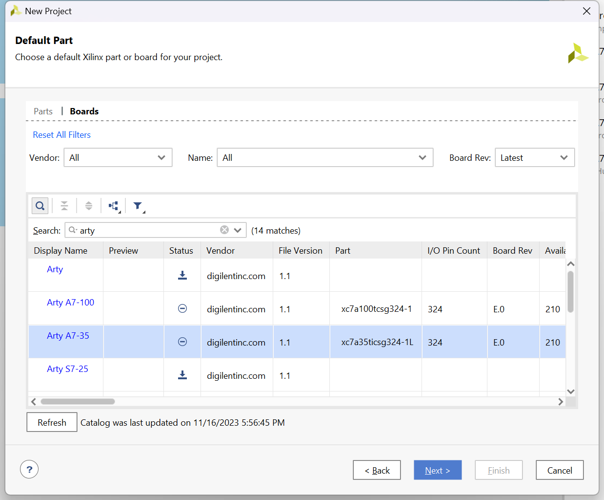

Click Next and Finish. The Vivado IDE will open an empty project.

Click Create Block Design, and name the design "system":

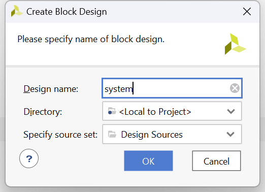

An empty block design window opens.

The Arty A7 comes with a relatively well-prepared board file, which allows many steps in the HW design to be automated in Vivado. However, as we will see later, some manual tweaks are still needed because the automation is far from perfect.

Let's start with the most complicated part, the Memory Interface Generator (MIG). This is an IP provided by Xilinx, which will generate a memory controller for the DDR installed on Arty A7.

Open the Board window (Window|Board). There is an item "DDR3 SDRAM". Drag it to the empty board design. Vivado does its magic and configures the MIG for the Arty A7 DDR3 memory based on settings in the board file. The following IP appears in the design:

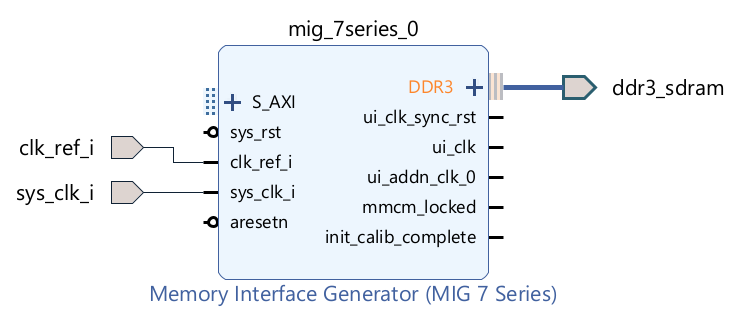

Unfortunately, there are two problems:

#### 1. MIG input Reference Clock must be 200 MHz

- The MIG requires the Reference Clock (clk_ref_i) to be 200 MHz. See [UG586](https://docs.xilinx.com/v/u/en-US/ug586_7Series_MIS), page 273.

- The Vitis assumes that we have an input port, which can clock MIG.clk_ref_i. But that is not the case. Arty A7 has only one on-board oscillator, which provides a 100 MHz clock.

- We will solve this issue easily by adding a Clocking Wizard, which will generate the 200 MHz clock based on the 100 MHz clock from the on-board oscillator.

#### 2. We can't connect the external system clock to MIG directly

- I learned "the hard way" that if we leave the external 100 MHz port sys_clk_i connected directly to MIG.sys_clk_i, we will later face an error during Implementation in case we use a pin from bank 35 in the design.
- Pins of  Xilinx Artix-7 FPGAs are organized into banks. Banks are identified by numbers. In the [schematics of Arty A7](https://digilent.com/reference/_media/programmable-logic/arty-a7/arty-a7-e2-sch.pdf) we can see that pins connected to sockets on the Arty A7 belong to banks 14, 15 and 35. All pins in a given bank must work on the same voltage. In the case of the Arty A7, banks 14, 15 and 35 work on 3.3 V.
- The problem is that MIG expects sys_clk_i to be 2.5 V, but the external 100 MHz oscillator is connected to the pin E3 in bank 35 and thus operates on 3.3 V (and the oscillator used in the circuit is actually a 3.3 V oscillator). Therefore Vitis raises the following error when I used a pin ck_a0 (also belonging to bank 35) in the design:
  - [DRC BIVC-1] Bank IO standard Vcc: Conflicting Vcc voltages in bank 35. For example, the following two ports in this bank have conflicting VCCOs:  
    sys_clk_i (LVCMOS25, requiring VCCO=2.500) and ck_a0[0] (LVCMOS33, requiring VCCO=3.300)
- I realize that the previous paragraphs may sound complicated, but the good news is that I found a solution to the issue. We simply add a [BUFG buffer](https://docs.xilinx.com/r/en-US/ug953-vivado-7series-libraries/BUFG) on the external clock input. My understanding is that adding BUFG changes the routing of the external clock so it doesn't collide with the rest of the pins in the bank 35.

Let's make the needed changes.

Delete ports clk_ref_i and sys_clk_i.  
(The port ddr3_sdram is OK. It represents connection to the DDR3 chip on the board and it was correctly configured by the automation.)

We must re-synthetize the MIG in order to get rid of automatically generated configuration related to sys_clk_i.

Double-click the MIG and click Next till you get to the "Memory Options C0" page. (Notice that the correct 100 MHz Input Clock Period is configured.)  
Disable "Select Additional Clocks". For MicroBlaze and rest of the IPs we do not need a clock generated from MIG, we will use a Clocking Wizzard.

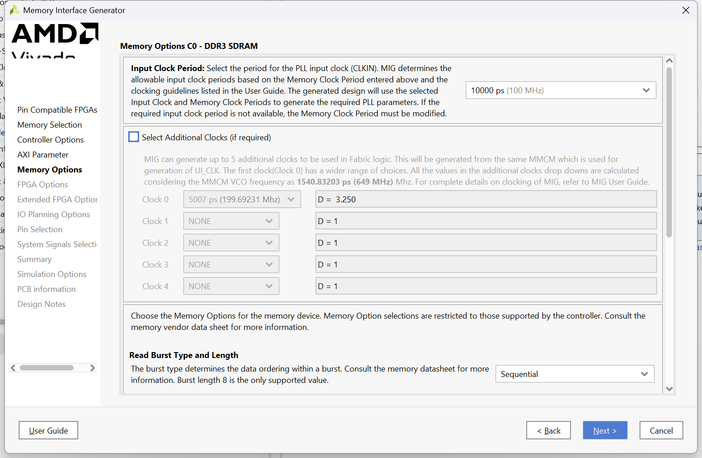

Click Next. And select System Clock "No Buffer".

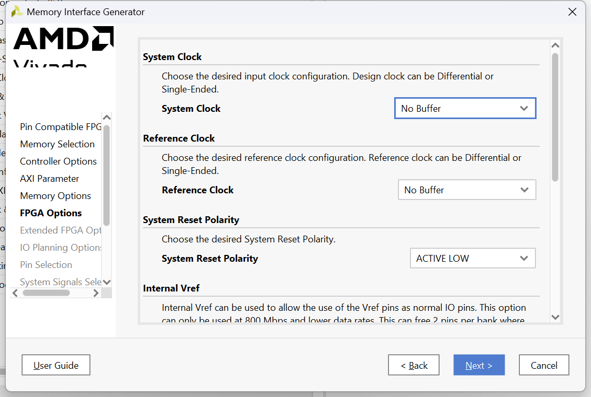

Then finish the MIG configuration wizard without further changes (you need to click Validate on the "Pin Selection For Controller 0" page to enable the Next button.).

Now we will manually create the ports we need.

Download [Arty-A7-100-Master.xdc](https://github.com/Digilent/digilent-xdc/blob/master/Arty-A7-100-Master.xdc) from the [Digilent GitHub](https://github.com/Digilent). The .xdc file for A7-100 works also for A7-35. The pin connection is the same.

- In fact, the A7-35 .xdc on GitHub seems to be wrong to me. It differs in the names of pins ck_io20..25, which are printed as cka6..11 on my specimen of A7-35. Do use .xdc for A7-100.

Add Arty-A7-100-Master.xdc as the constraints file to Vivado (window Sources, "+" button). Do not forget to check "Copy constraints file into project". We want to have a copy of the file in the project because we are going to edit it.

Open the .xdc file in the editor. Uncomment the two lines for port CLK100MHZ and the lines for ports ck_a0 and ck_rst.  
So the effective content of the .xdc file will be as follows:

```
## Clock signal
set_property -dict { PACKAGE_PIN E3    IOSTANDARD LVCMOS33 } [get_ports { CLK100MHZ }]; #IO_L12P_T1_MRCC_35 Sch=gclk[100]
create_clock -add -name sys_clk_pin -period 10.00 -waveform {0 5} [get_ports { CLK100MHZ }];

## ChipKit Outer Analog Header - as Digital I/O
set_property -dict { PACKAGE_PIN F5    IOSTANDARD LVCMOS33 } [get_ports { ck_a0 }]; #IO_0_35 Sch=ck_a[0]

## Misc. ChipKit Ports
set_property -dict { PACKAGE_PIN C2    IOSTANDARD LVCMOS33 } [get_ports { ck_rst }]; #IO_L16P_T2_35 Sch=ck_rst
```

Now add the three ports to the diagram (select Create Port in the context menu, which opens on the right-click on an empty diagram space). Select port type. Set the frequency for CLK100MHZ and the polarity Active Low for ck_rst (this is because the button connected to the ck_rst port generates a high signal when <u>not</u> pressed).

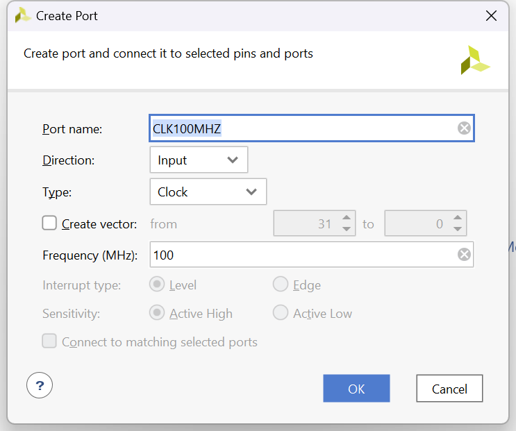

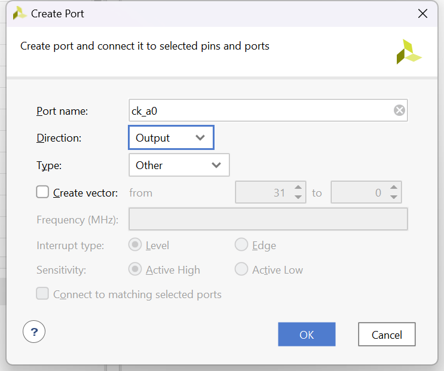

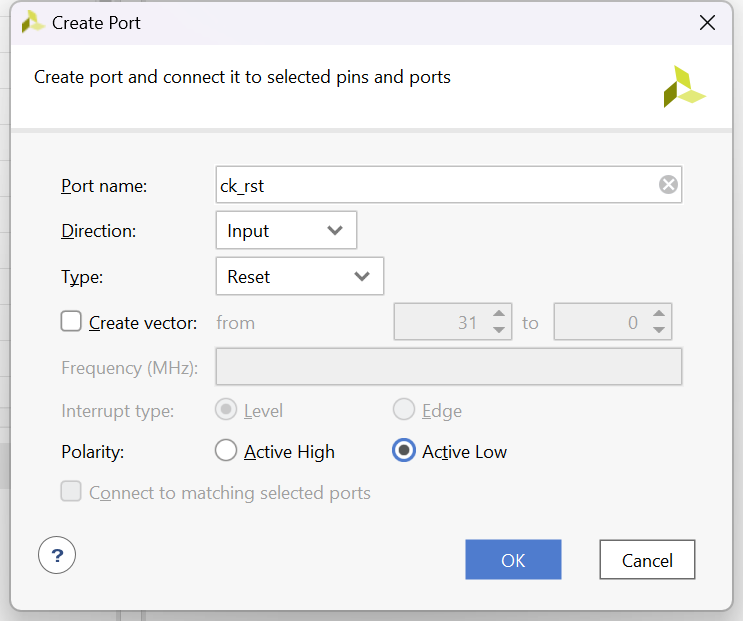

**Do not run Connection Automation yet.**

Search for "buffer" in the IP Catalog and drag Utility Buffer to the diagram. Double-click it for configuration and select C Buf Type as BUFG.

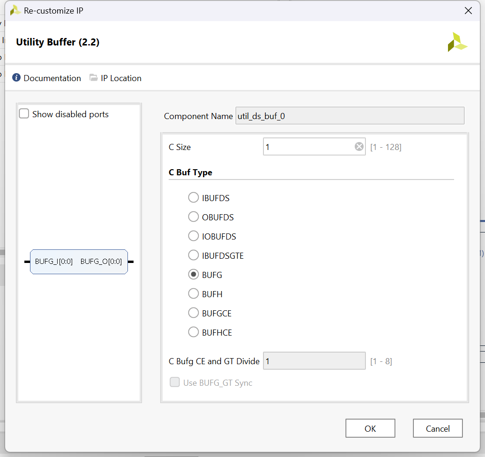

Connect CLK100MHZ to BUFG_I and BUFG_O to MIG.sys_clk_i.  
Connect ck_rst to MIG.ck_rst.  
(We leave ck_a0 unconnected for now.)

Next we need to add a Clocking Wizzard to generate the 200 MHz clock needed as the input Reference Clock for MIG and the 210 MHz clock we will use to clock the MicroBlaze and other IPs.

Search for "clocking" in the IP Catalog and drag Clocking Wizzard to the diagram. Double-click on the Clocking Wizzard to configure it. We do changes only on the Output Clocks tab. Define the two output clocks as 200 MHz and 210 MHz and set Reset Type Active Low.

- 210 MHz clock for MicroBlaze worked OK in my testing. Maybe you can go a bit higher. Finding a high-frequency clock for a stable design requires some experimenting.

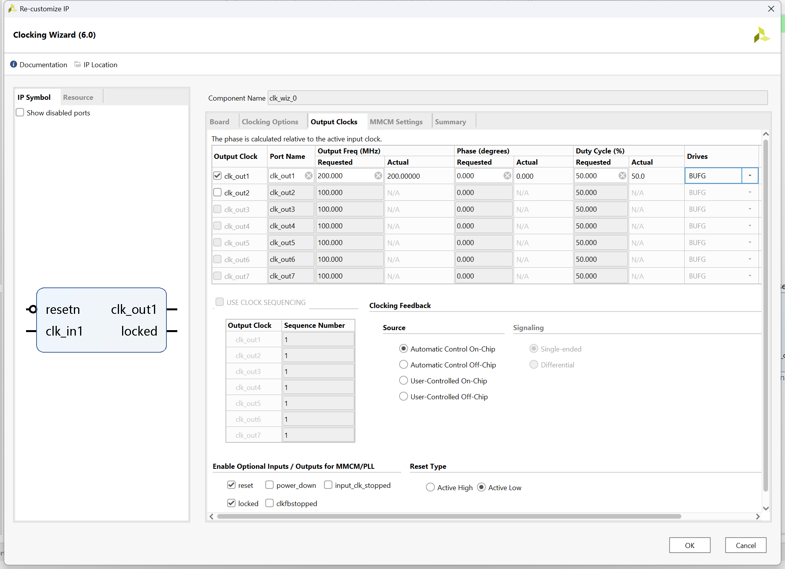

Connect ck_rst to the resetn of the Clocking Wizzard, BUFG_O to clk_in1 and clk_out1 to MIG.clk_ref_i.  
So now we have the following diagram:


xxxx

Drag USB UART  from the Board window to the diagram. It will create AXI UART lite IP.

Search for "gpio" in the IP Catalog and drag AXI GPIO to the diagram. Double-click it for configuration. We need just one output GPIO pin for our demo, so we select "All Outputs" and set "GPIO Width" to 1:

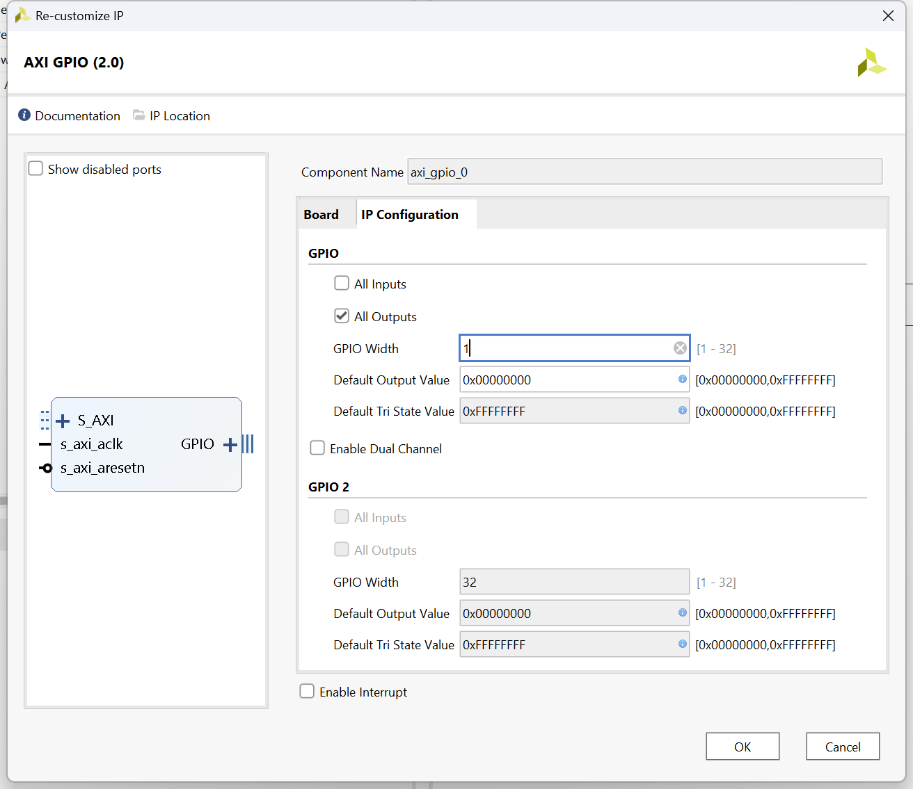

Connect ck_a0 to the output GPIO pin.

So now we have this (still very simple) diagram:

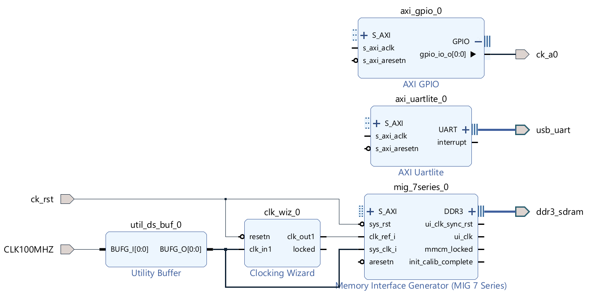

Now it's time to add the MicroBlaze. Search for "micro" in the IP Catalog and drag MicroBlaze to the diagram.

"Run Block Automation" appears on the top of the diagram. Click on it.

**TODO**

Application, disable Interrupt Controller.
ck_out2

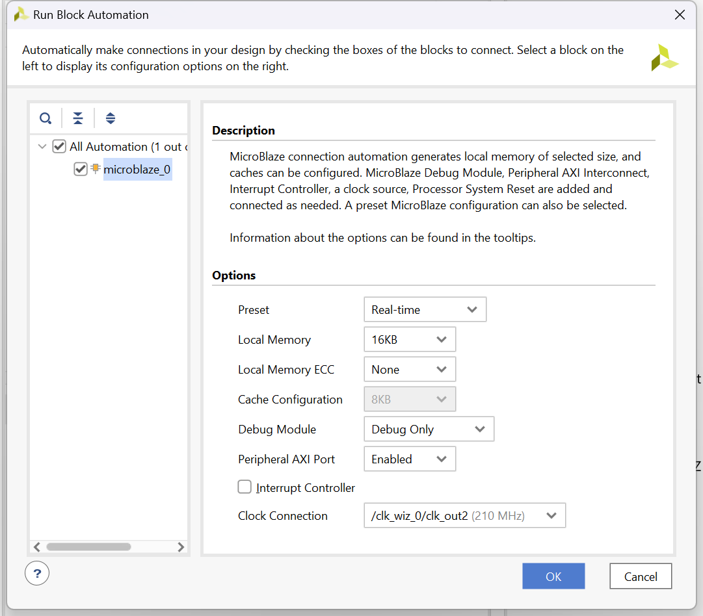

**TODO**

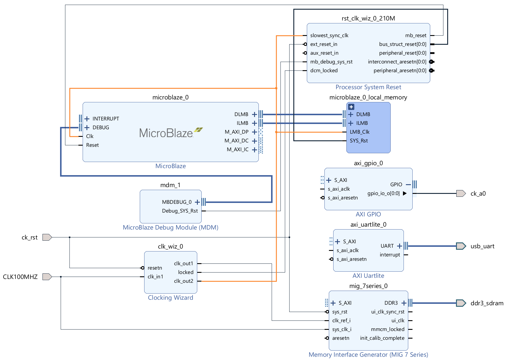

**TODO**

MicrobLaze Next to cache configuration. Increase instruction cache to 16 kB, and data cache to 32 kB. Set the Number of Victims to 4.

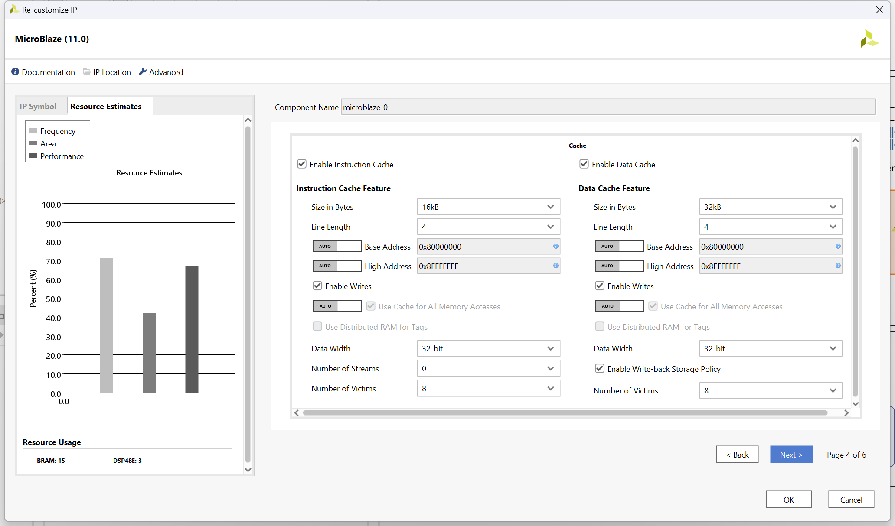

"Run Connection Automation" appears on the top of the diagram. Click on it. Select "All Automation", leave default values set, and click OK.

Validate Design button or F6.

Sources, right-click on system, select "Create HDL Wrapper", select "Let Vivado manage wrapper".
