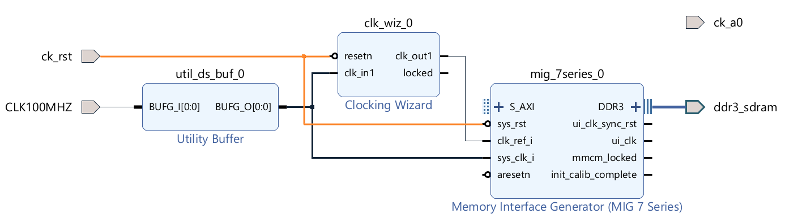

# MicroBlaze with DDR RAM on Arty A7

This tutorial describes how to do a HW design of [MicroBlaze Soft Processor](https://www.xilinx.com/products/design-tools/microblaze.html) using DDR3 RAM on the [Digilent Arty A7](https://digilent.com/reference/programmable-logic/arty-a7/start) FPGA development board in Vivado 2023.1.

## Memory Interface Generator configuration and connections

Start Vivado 2023.1. Click Create Project. Click Next.
Enter the project name and directory. Click Next.
Select "RTL Project" and "Do not specify sources at this time". Click Next.

Select Arty A7-100 or -35 board based on the board you are using. The steps in this tutorial are exactly the same for both models. By selecting the board, we will use the board file provided by Digilent.


Click Next and Finish. The Vivado IDE will open an empty project.

Click Create Block Design, and name the design "system":


An empty block design window opens.

The Arty A7 comes with a relatively well-prepared board file, which allows many steps in the HW design to be automated in Vivado. However, as we will see later, some manual tweaks are still needed because the automatic is far from perfect.

Let's start with the most complicated part, the Memory Interface Generator (MIG). This is an IP provided by Xilinx, which will generate a memory controller for the DDR installed on Arty A7.

Open the Board window (Window|Board). There is an item "DDR3 SDRAM". Drag it to the empty board design. Vivado does its magic and configures the MIG for the Arty A7 DDR3 memory based on settings in the board file. The following IP appears in the design:


Unfortunately, there are two problems:


 it knows 100 MHz input clock. We disable ui_addn_clk.


We must add a [BUFG buffer](https://docs.xilinx.com/r/en-US/ug953-vivado-7series-libraries/BUFG) for the sys_clk_i, otherwise, we would get an error during implementation saying "[DRC BIVC-1] Bank IO standard Vcc: Conflicting Vcc voltages in bank 35" stating conflicting voltages of sys_clk_i and ck_a0.
My understanding is that adding BUFG changes routing of the sys_clk_i so it doesn't collide with the rest of pins in the bank 35.

Search for "buffer" in the IP Catalog and drag Utility Buffer to the diagram. Double-click it for configuration and select C Buf Type as BUFG.


Connect sys_clk_i to BUFG_I and BUFG_O to MIG.sys_clk_i.

Double-click the MIG and click Next till you get to the "Memory Options C0" page. Disable "Select Additional Clocks":


Then finish the MIG configuration wizard without further changes (you need to click Validate on the "Pin Selection For Controller 0" page to enable the Next button.).

Delete ports clk_ref_i and sys_clk_i.

Download [Arty-A7-100-Master.xdc](https://github.com/Digilent/digilent-xdc/blob/master/Arty-A7-100-Master.xdc) from Digilent GitHub
XDC file for A7-100 works also for A7-35. The pin connection is the same.

- In fact, the A7-35 XDC on GitHub seems to be wrong. It differs only in the names of pins ck_io20..25, which are printed as cka6..11 on my specimen of A7-35.

Add Arty-A7-100-Master.xdc as the constraints file to Vivado (window Sources, "+" button). Do not forget to check "Copy constraints file into project". We want to have a copy of the file in the project because we are going to edit it.

Open the .xdc file in the editor. Uncomment the two lines for port CLK100MHZ and the lines for ports ck_a0 and ck_rst.
So the effective content of the .xdc file will be as follows:

```
## Clock signal
set_property -dict { PACKAGE_PIN E3    IOSTANDARD LVCMOS33 } [get_ports { CLK100MHZ }]; #IO_L12P_T1_MRCC_35 Sch=gclk[100]
create_clock -add -name sys_clk_pin -period 10.00 -waveform {0 5} [get_ports { CLK100MHZ }];

## ChipKit Outer Analog Header - as Digital I/O
set_property -dict { PACKAGE_PIN F5    IOSTANDARD LVCMOS33 } [get_ports { ck_a0 }]; #IO_0_35 Sch=ck_a[0]

## Misc. ChipKit Ports
set_property -dict { PACKAGE_PIN C2    IOSTANDARD LVCMOS33 } [get_ports { ck_rst }]; #IO_L16P_T2_35 Sch=ck_rst
```

Now add the ports to the diagram (click Create Port in the context menu, which opens on the right-click on an empty diagram space). Select port type. Set the frequency for CLK100MHZ and the polarity Active Low for ck_rst (this is because the button connected to the ck_rst port generates a high signal when not pressed).


**Do not run Connection Automation yet.**

Now we need to add a Clocking Wizzard to generate the 200 MHz clock needed as the input Reference Clock for MIG and the 210 MHz clock we will use to clock the MicroBlaze and other IPs.

Search for "clock" in the IP Catalog and drag Clocking Wizzard to the diagram. Double-click on the Clocking Wizzard to configure it. We do changes only on the Output Clocks tab, defining the two output clocks and setting Reset Type Active Low:


Connect the ports as follows (we connect ck_a0 later):


Drag USB UART  from the Board window to the diagram. It will create AXI UART lite IP.

Search for "gpio" in the IP Catalog and drag AXI GPIO to the diagram. Double-click it for configuration. We need just one output GPIO pin for our demo, so we select "All Outputs" and set "GPIO Width" to 1:


Connect ck_a0 to the output GPIO pin.

So now we have this (still very simple) diagram:


Now it's time to add the MicroBlaze. Search for "micro" in the IP Catalog and drag MicroBlaze to the diagram.

"Run Block Automation" appears on the top of the diagram. Click on it.

**TODO**

Application, disable Interrupt Controller.
ck_out2


**TODO**


**TODO**

MicrobLaze Next to cache configuration. Increase instruction cache to 16 kB, and data cache to 32 kB. Set the Number of Victims to 4.


"Run Connection Automation" appears on the top of the diagram. Click on it. Select "All Automation", leave default values set, and click OK.

Validate Design button or F6.

Sources, right-click on system, select "Create HDL Wrapper", select "Let Vivado manage wrapper".
