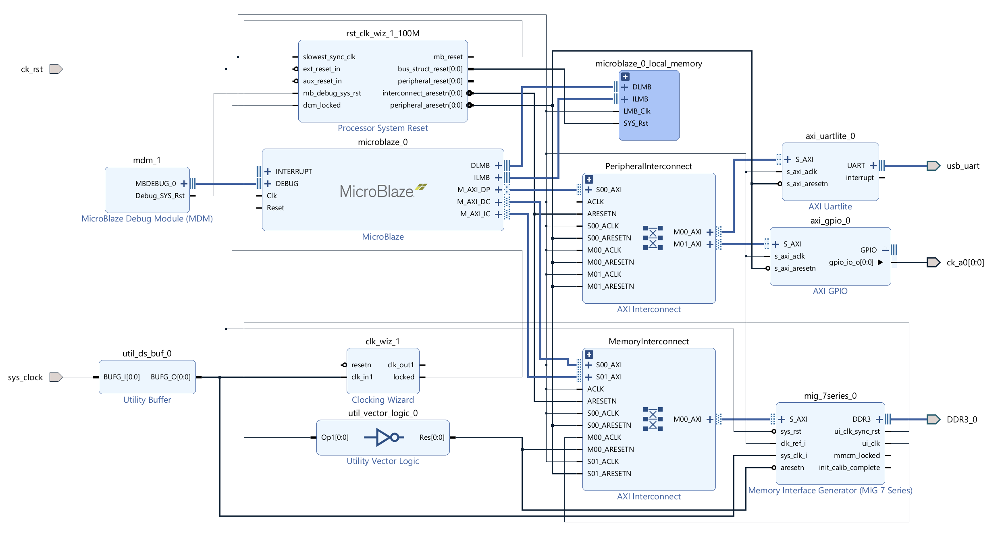

# Demo of MicroBlaze using DDR3 RAM on ArtyA7

This is a demo HW design of [MicroBlaze](https://www.xilinx.com/products/design-tools/microblaze.html) using DDR RAM on a [Digilent Arty A7 board](https://digilent.com/shop/arty-a7-100t-artix-7-fpga-development-board/).

Included application is a benchmarking tool for memory read speed.

The design was done in Vivado 2023.1 and Vitis 2023.1.

Tested on Arty A7-35 (no longer in production), but it should be very easy to port to Arty A7-100.

# MicroBlaze HW design using DDR3 RAM

The design is made in Vivado 2023.1 for Arty A7-35.
**If you have Arty A7-100, you need to change the board to A7-100 in Tools|Settings|General|Project device.** No other changes in the design should be necessary.

Please note that in the design, I, on purpose, deviated from some parts of the Arty A7 documentation.

Memory Interface Generator \(MIG) input System Clock (sys_clk_i) is driven by an external 100 MHz oscillator in my design.
The Arty A7 [Reference Manual](https://digilent.com/reference/programmable-logic/arty-a7/reference-manual#ddr3l) recommends a 166.67 MHz input clock, but a clock of such frequency can be obtained only internally on the ship by a Clocking Wizard. However, the MIG User Guide says, "The input system clock cannot be generated internally". See [UG586](https://docs.xilinx.com/v/u/en-US/ug586_7Series_MIS), page 210. It's because driving it from an MMCM might introduce too much jitter.

A design with a 166.67 MHz internally generated MIG input System Clock may work (it worked in my tests). But it is not guaranteed to work, especially when the FPGA design gets more complex.

I therefore did the design "by the UG586 book" and used the external 100 MHz oscillator of Arty A7.
I had to add BUFG Utility Buffer to the external clock signal. Specifying System Clock's Single-ended buffer in the configuration of MIG didn't work for me. I was getting errors that the I/O standards of various signals don't match.

Having the MIG input System Clock 100 MHz instead of 166.67 MHz necessitates setting a longer DDR3 clock period of 3077 ps (325 MHz) instead of 3000 ps (333.3 MHz).

