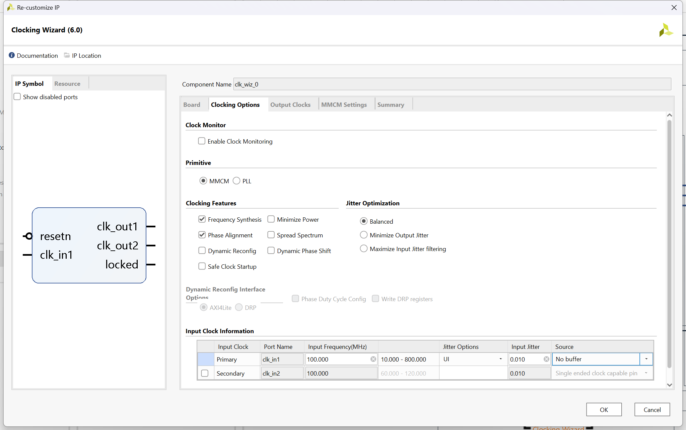
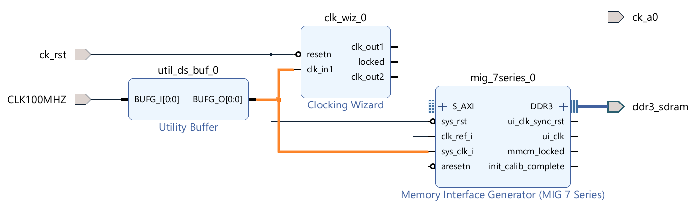
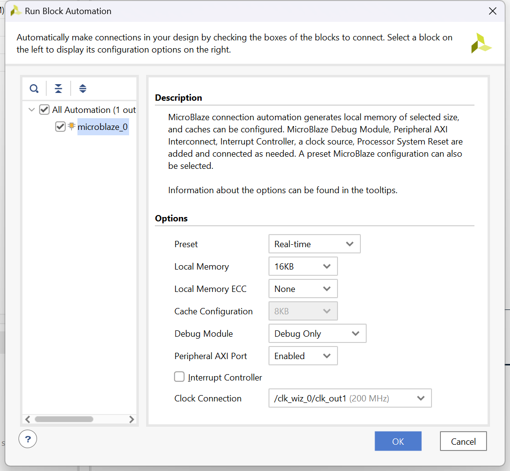
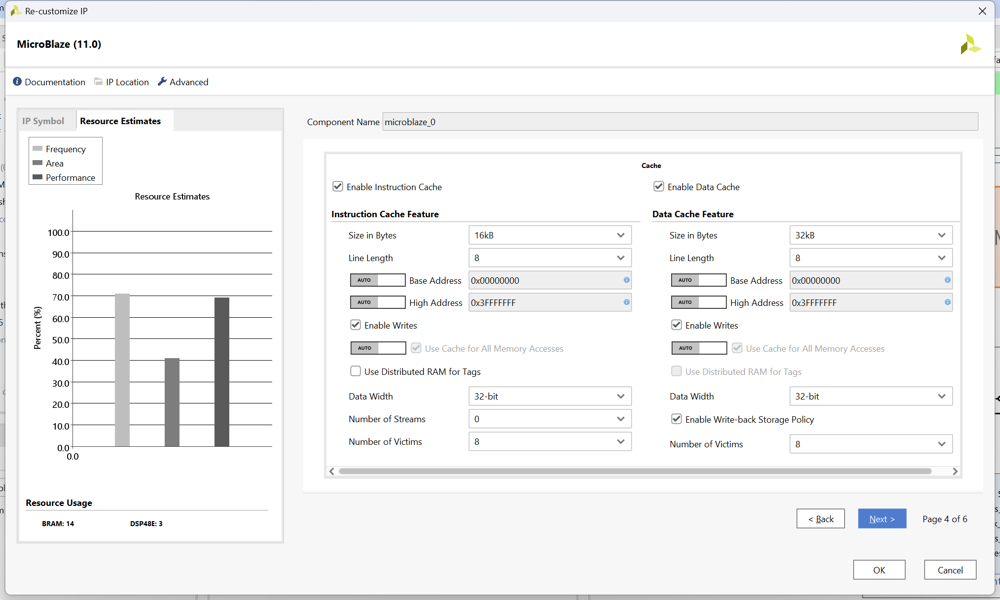
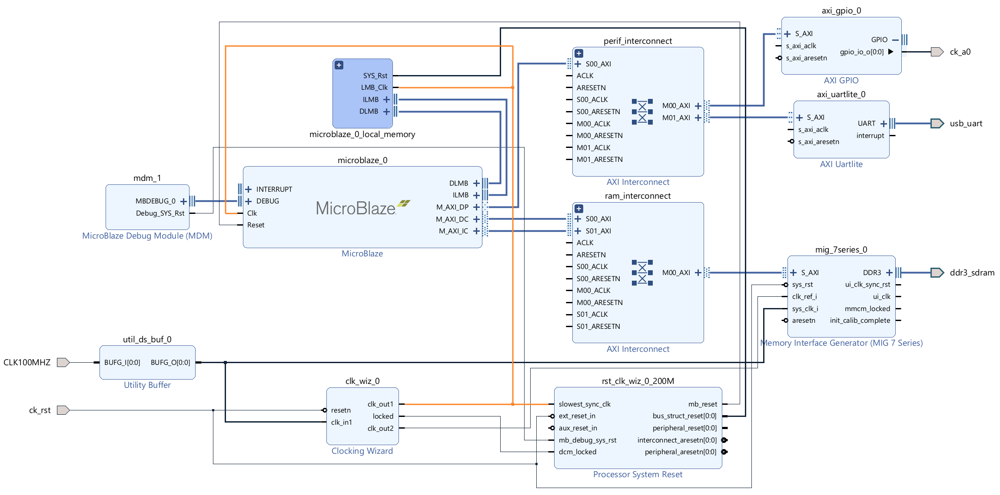
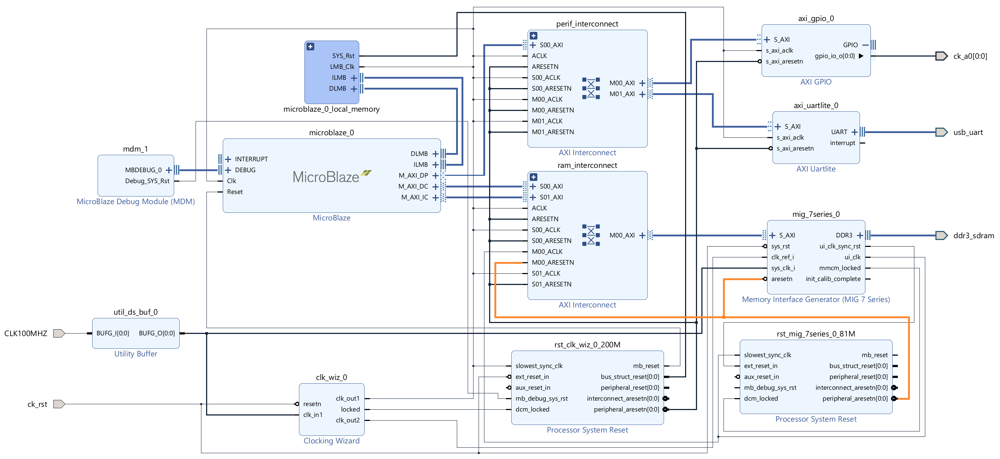

# Tutorial: MicroBlaze with DDR3 RAM on Arty A7

This tutorial describes how to do a HW design of [MicroBlaze Soft Processor](https://www.xilinx.com/products/design-tools/microblaze.html) using DDR3 RAM on the [Digilent Arty A7](https://digilent.com/reference/programmable-logic/arty-a7/start) FPGA development board in Vivado 2023.1.

The same steps and design should be applicable to any Digilent board with a 100 MHz crystal oscillator and a DDR interface, including [Nexys A7](https://digilent.com/shop/nexys-a7-fpga-trainer-board-recommended-for-ece-curriculum/), [Arty S7](https://digilent.com/shop/arty-s7-spartan-7-fpga-development-board/), [Nexys Video](https://digilent.com/shop/nexys-video-artix-7-fpga-trainer-board-for-multimedia-applications/) and [USB104 A7](https://digilent.com/shop/usb104-a7-artix-7-fpga-development-board-with-syzygy-compatible-expansion/).

Most of the steps in this tutorial can be used also for MicroBlaze DDR3 design on boards from other manufacturers. 

Included application is a benchmarking tool for memory read speed.

## Memory Interface Generator configuration and connections

Start Vivado 2023.1. Click Create Project. Click Next.  
Enter the project name and directory. Click Next.  
Select "RTL Project" and "Do not specify sources at this time". Click Next.

Select Arty A7-100 or -35 board based on the board you are using. The steps in this tutorial are exactly the same for both models. By selecting the board, we will use the board file provided by Digilent.


Click Next and Finish. The Vivado IDE will open an empty project.

Click Create Block Design, and name the design "system":


An empty block design window opens.

The Arty A7 comes with a relatively well-prepared board file, which allows steps in the HW design to be automated in Vivado. However, as we will see later, some manual tweaks are still needed because the automation is not perfect.

Let's start with the most complicated part, the Memory Interface Generator (MIG). This is an IP provided by Xilinx, which will generate a memory controller for the DDR3 SDRAM installed on Arty A7.

Open the Board window (Window|Board). There is an item "DDR3 SDRAM". Drag it to the empty board design. Vivado does its magic and configures the MIG for the Arty A7 DDR3 memory based on settings in the board file. The following IP appears in the design:


> [!TIP]
> In case you are using a board other than Arty A7 and your board doesn't come with proper board files, you would need to drag the MIG to the block design from the IP Catalog and configure it manually based on the documentation available for your board.  
> The rest of this tutorial is also valid for a MIG configured manually.

Unfortunately, there are two problems with the MIG just created by the Vivado automation:

#### 1. MIG input Reference Clock must be 200 MHz

- The MIG requires the Reference Clock (clk_ref_i) to be 200 MHz. See [UG586](https://docs.xilinx.com/v/u/en-US/ug586_7Series_MIS), page 273.

- The Vitis assumes that we have an input port that can clock MIG.clk_ref_i. But that is not the case. Arty A7 has only one on-board oscillator, which provides a 100 MHz clock, not 200 MHz.

- We will solve this issue easily by adding a Clocking Wizard, which will generate the 200 MHz clock based on the 100 MHz clock from the on-board oscillator.

#### 2. We can't connect the external system clock to MIG directly

- I learned "the hard way" that if we leave the external 100 MHz port sys_clk_i connected directly to MIG.sys_clk_i, we will later face an error during Implementation in case we use a pin from bank 35 in the design.
- Pins of  Xilinx Artix-7 FPGAs are organized into banks. Banks are identified by numbers. In the [schematics of Arty A7](https://digilent.com/reference/_media/programmable-logic/arty-a7/arty-a7-e2-sch.pdf) we can see that pins connected to sockets on the Arty A7 belong to banks 14, 15 and 35. All pins in a given bank must work on the same voltage. In the case of the Arty A7, banks 14, 15 and 35 work on 3.3 V.
- The problem is that MIG expects sys_clk_i to be 2.5 V, but the external 100 MHz oscillator is connected to the Artix-7 pin named E3, which is in bank 35 and thus operates on 3.3 V (and the oscillator used in the circuit is actually a 3.3 V oscillator). Therefore Vitis raises the following error when I used a pin ck_a0 (also belonging to bank 35) in the design:
  - [DRC BIVC-1] Bank IO standard Vcc: Conflicting Vcc voltages in bank 35. For example, the following two ports in this bank have conflicting VCCOs:  
    sys_clk_i (LVCMOS25, requiring VCCO=2.500) and ck_a0[0] (LVCMOS33, requiring VCCO=3.300)
- I realize that the previous paragraphs may sound complicated, but the good news is that I found a solution to the issue. We simply add a [BUFG buffer](https://docs.xilinx.com/r/en-US/ug953-vivado-7series-libraries/BUFG) on the external clock input. My understanding is that adding BUFG changes the routing of the external clock so it doesn't collide with the rest of the pins in the bank 35.

Let's make the needed changes.

Delete ports clk_ref_i and sys_clk_i.  
(The port ddr3_sdram is OK. It represents a connection to the DDR3 chip on the board and it was correctly configured by the automation.)

> [!IMPORTANT]
> We must re-synthetize the MIG in order to get rid of automatically generated configuration related to sys_clk_i. If we didn't do it, we would get critical warnings or errors during the Implementation.

Double-click the MIG and click Next till you get to the "Memory Options C0" page.

- Remark: Notice that the correct 100 MHz Input Clock Period was configured by the automation. It's important to understand that only certain ratios between the Input Clock and the DDR3 clock are supported (technical reasons for this are described in [UG586](https://docs.xilinx.com/v/u/en-US/ug586_7Series_MIS), page 210). Because our Input Clock has to be 100 MHz, the automation set the DDR3 clock period to 3077 ps (325 MHz) as you can check on the "Options for Controller 0" page of the MIG configuration wizard. 325 MHz is lower than the maximum possible 333 MHz clock of the DDR3 memory used on Arty A7. Nevertheless, the performance difference is negligible.

Disable "Select Additional Clocks". For MicroBlaze and the rest of the IPs, we do not need a clock generated from the MIG, we will use a Clocking Wizzard.


Click Next. And select System Clock "No Buffer". (As explained earlier, we will add a [BUFG buffer](https://docs.xilinx.com/r/en-US/ug953-vivado-7series-libraries/BUFG) to the design manually.)


Then finish the MIG configuration wizard without further changes (note that you need to click Validate on the "Pin Selection For Controller 0" page to enable the Next button.).

Now we will manually create the ports we need.

Download [Arty-A7-100-Master.xdc](https://github.com/Digilent/digilent-xdc/blob/master/Arty-A7-100-Master.xdc) from the [Digilent GitHub](https://github.com/Digilent).  
The .xdc file for A7-100 works also for A7-35. The pin connections are the same. A7-100 and A7-35 .xdc files differ only slightly in some comments.

Add Arty-A7-100-Master.xdc as the constraints file to Vivado (window Sources, "+" button). Do not forget to check "Copy constraints file into project". We want to have a copy of the file in the project because we are going to edit it.

Open the .xdc file in the editor. Uncomment the two lines for port CLK100MHZ and the lines for ports ck_a0 and ck_rst.  
So the effective content of the .xdc file will be as follows:

```
## Clock signal
set_property -dict { PACKAGE_PIN E3    IOSTANDARD LVCMOS33 } [get_ports { CLK100MHZ }]; #IO_L12P_T1_MRCC_35 Sch=gclk[100]
create_clock -add -name sys_clk_pin -period 10.00 -waveform {0 5} [get_ports { CLK100MHZ }];

## ChipKit Outer Analog Header - as Digital I/O
set_property -dict { PACKAGE_PIN F5    IOSTANDARD LVCMOS33 } [get_ports { ck_a0 }]; #IO_0_35 Sch=ck_a[0]

## Misc. ChipKit Ports
set_property -dict { PACKAGE_PIN C2    IOSTANDARD LVCMOS33 } [get_ports { ck_rst }]; #IO_L16P_T2_35 Sch=ck_rst
```

Now add the three ports to the diagram (select Create Port in the context menu, which opens on the right-click on an empty diagram space). Select port type. Set the frequency for CLK100MHZ and the polarity Active Low for ck_rst (this is because the button connected to the ck_rst port generates a high signal when <ins>not</ins> pressed).


**Do not run Connection Automation yet.**

Search for "buffer" in the IP Catalog and drag Utility Buffer to the diagram. Double-click it for configuration and select C Buf Type as BUFG.


Connect CLK100MHZ to BUFG_I and BUFG_O to MIG.sys_clk_i.  
Connect ck_rst to MIG's sys_rst port.  
(We leave ck_a0 unconnected for now.)

Next, we need to add a Clocking Wizzard to generate the 200 MHz clock needed as the input Reference Clock for the MIG, and the clock for the MicroBlaze and other IPs.

> [!IMPORTANT]
> The MicroBlaze tutorials I found on the internet generally clock the MicroBlaze on 100 MHz. I discovered during my testing that going higher is possible but somewhat tricky. The design I'm presenting here is a result of a considerable amount of "trial and error" testing.  
> For example: When I created a Clocking Wizard with a single 200 MHz output clock and used it for both the MIG Reference Clock and the MicroBlaze (including peripherals), the design worked fine with MicroBlaze instruction and data caches disabled but failed with caches enabled. When I switched to a Clocking Wizzard with two output clocks of the same 200 MHz frequency (one connected to the MIG Reference Clock, the other to the MicroBlaze and peripherals), everything worked fine. I'm not able to explain what the issue was when a single source clock was used.  
> In my testing, the MicroBlaze didn't work with a frequency above 210 MHz, so I will stay on 200 MHz in this demo to be safe.  
> Please be aware that if you modify my design and face issues, the first troubleshooting step is to lower the MicroBlaze frequency.  
> Another troubleshooting trick is to clock the MicroBlaze and peripherals from a separate Clocking Wizard, which is not used for anything else.

Search for "clocking" in the IP Catalog and drag Clocking Wizzard to the diagram. Double-click on the Clocking Wizzard to configure it.  
Go to the Clocking Options tab and select Source "No buffer" in the Input Clock Information section because the input clock is already buffered by BUFG.



Then go to the Output Clocks tab.

For the reasons described earlier, we will create two output clocks of the same 200 MHz frequency. ck_out1 will clock the MicroBlaze and all other IPs except the MIG. The frequency of the ck_out1 can be lowered if any stability issues occur. ck_out2 will clock the MIG Reference Clock and must always be kept on 200 MHz.

Set Reset Type Active Low because our reset input ck_rst is active low.


Connect ck_rst to the resetn of the Clocking Wizzard, BUFG_O to clk_in1 and clk_out2 to MIG.clk_ref_i.  
So now we have the following diagram:



## Peripherals

We will use only USB UART and GPIO in this demo design. Nevertheless, other peripherals (e.g., SPI) can be added to the design in a similar manner.

For UAT we use the benefit of the board file. Drag "USB UART" from the Board window to the diagram. It will create AXI UART lite IP and corresponding input/output port.

We add GPIO manually. Search for "gpio" in the IP Catalog and drag AXI GPIO to the diagram. Double-click it for configuration. We need just one output GPIO pin for our demo, so we select "All Outputs" and set "GPIO Width" to 1:


Connect ck_a0 to the output GPIO pin.  
**Do not run Connection Automation yet.**

So now we have this (still very simple) diagram:


## MicroBlaze

Now it's time to add the MicroBlaze. Search for "micro" in the IP Catalog and drag MicroBlaze to the diagram.

"Run Block Automation" appears on the top of the diagram. Click on it. This will open a window for the initial configuration of the MicroBlaze processor.

We are offered three preset configurations. I like to use the "Real-time" preset.

Then is the local memory setting, i.e. the memory on the Artix-7 FPGA.   
All this demo is based on configuring MicroBlaze to use the DDR3 memory (which is much bigger in size than the memory available on the FPGA chip). The demo app will be running in the DDR3 memory.  
However, I recommend selecting 16kB of the local memory. This is for future use. When you decide to load the FPGA configuration and MicroBlaze app from the flash (like on a production device), you will need the local memory to store the MicroBlaze bootloader, which will load the app from the flash to DDR3 memory. See this tutorial on the topic: [MicroBlaze SREC SPI bootloader](https://shadowcode.io/microblaze-srec-spi-bootloader-hardware/).

We don't need ECC, and the "Debug Only" Debug Module will be sufficient.

Make sure that the "Peripheral AXI Port" is enabled.

Disable Interrupt Controller; we won't be using interrupts in this demo. If needed, it can be added to the design later.

We will use the clock /clk_wiz_0/clk_out1 for MicroBlaze, select it as the Clock Connection.



After clicking OK a lot will happen in the diagram.  
Automation added a Debug Module and local memory for the MicroBlaze. Processor System Reset IP was added to generate a reset signal for MicroBlaze, which is synchronized with the clock.


Let's do a fine-tuning of the MicroBlaze configuration before we continue. 

The performance of the app running on MicroBlaze is totally dependent on the amount of instruction and data cache you can provide to the processor. Make it as big as possible. The cache in FPGA's local memory is tremendously faster than the DDR3 RAM.

The [testing app](project_files/MicroBlaze_DDR_speed_test_sw) in this repository is a simple memory read speed test. On a 30 kB array (which fits into the cache), it runs 7.24 milliseconds when the caches are disabled. It runs 0.088 milliseconds from the cache (this is not a typo; it does run only 88 microseconds from the cache).

Double-click on the MicroBlaze and click Next till the cache configuration page.  
Increase instruction cache to 16 kB and data cache to 32 kB. Set the Line Length to 8 and the Number of Victims to 8.



Go to the next page for Debug configuration, and set "Number of Write Address Watchpoints" and "Number of Read Address Watchpoints" to 1. This will make debugging a bit easier.  
Finish the configuration wizard by clicking Next.

**Do not run Connection Automation yet.**

## Connecting it together

Now we create two AXI Interconnects. One will connect the MicroBlaze with DDR3 RAM, and the other will connect the MicroBlaze with peripherals.

> [!TIP]
> I'm aware that if we click "Run Connection Automation" at this moment, the automation will create the interconnects for us.  
> The problem is that automation will create [AXI SmartConnect](https://www.xilinx.com/products/intellectual-property/smartconnect.html) between the MicroBlaze and the DDR3 RAM. In my testing of DDR3 RAM read speed AXI SmartConnect resulted in 10% slower performance compared to the "old fashioned" AXI Interconnect (interconnect type was the only design change between the tests).  
> I'm sure AXI SmartConnect has some advantages. However, in this particular design on this particular board, the AXI Interconnect is faster.

Search for "interconnect" in the IP Catalog and drag AXI Interconnect twice to the diagram.  
Name one of them "perif_interconnect" and the other "ram_interconnect" (you rename an IP in the Sub-block Properties window).

Double-click on ram_interconnect and configure it to have two Slave and one Master interface. Leave Interconnect Optimization Strategy to Custom.  
(perif_interconnect was, by default, created to have one Slave and two Master interfaces, which is exactly what we need.)

Connect the two ram_interconnect AXI Slave interfaces to M_AXI_DC and M_AXI_IC interfaces on the MicroBlaze (the order in which you connect them doesn't matter). Connect ram_interconnect Master interface to MIG AXI Slave interface.

Connect the two perif_interconnect Master interfaces to AXI GPIO and AXI UART Lite. The AXI Slave interface of perif_interconnect should be connected to the M_AXI_DP interface of the MicroBlaze.

Now you shall have the following diagram (I moved IPs around for more clarity):



Now we can let the automation do the rest of the work, i.e., connect the clock and reset signals.

"Run Connection Automation" appears on the top of the diagram. Click on it. Select "All Automation", leave default values unchanged (the automation will connect the clock and reset signals based on AXI connections we made), and click OK.

Another Vivado magic happens, and we now have an almost final diagram.

The last step is to connect MIG.aresetn with ram_interconnect.M00_ARESETN manually (this makes both aresetn signals connected to peripheral_aresetn of a new Processor System Reset IP, which the automation created).  
The Connection Automation didn't do this last connection for me.

I moved IPs around for more clarity before I took this final snapshot:



Let me provide a few comments on what we see in the final diagram:

- Everything is clocked by the 200 MHz clock from the Clocking Wizard except the ram_interconnect AXI Master interface, i.e., the interface connecting ram_interconnect and MIG.  
  This interface must be clocked by the output ui_clk from the MIG (in our case it is ¼ of the DDR3 RAM clock, i.e. 81.25 MHz).

- It's OK that the ram_interconnect has the Master interface running on 81.25 MHz and Slave interfaces running on 200 MHz. One of the AXI Interconnect features is providing a bridge over two different clock domains.  
  The overall throughput is, of course, limited by the slower of the clocks.

- Reset is done by the peripheral_aresetn outputting from the Processor System Reset IP for the MicroBlaze (rst_clk_wiz_0_200M). The Processor System Reset IP ensures that this reset signal is synchronized with the 200 MHz clock.   
  The only exception is again the ram_interconnect AXI Master interface, whose reset must be synchronized with the clock MIG.ui_clk. To achieve that the automation created a second Processor System Reset IP (rst_mig_7series_0_81M), which also provides the AXI Slave interface reset signal (aresetn) to the MIG.

## Generating output

To make sure that nothing was missed, click the Validate Design button in the toolbar of the diagram window (or press F6).  
You will probably get a message that there are unassigned address segments. Click Yes for auto-assigning them.

HDL Wrapper for the diagram needs to be created: Go to Sources|Design Sources, right-click on "system", select "Create HDL Wrapper", and select "Let Vivado manage wrapper".

Now we create the design outputs: Click "Generate Bitstream" in the Flow Navigator on the left. Synthesis and Implementation will be run automatically before bitstream generation.

There should be no errors. However, expect one critical warning which says "[Timing 38-282] The design failed to meet the timing requirements.".  
In this demo, we do not need to worry about timing requirements.

Last but not least, we need to export the hardware specification. It is necessary for the development of the SW app for the MicroBlaze in Vitis IDE.  
Go to File|Export|Export Hardware, select "Include Bitstream".

## Project files

The directory [project_files](project_files) contains the HW design created by this tutorial and an application, which benchmarks memory read speed.

See the directory's [readme file](project_files/README.md) for details.

## Differences from the Arty A7 documentation

Please note that in this HW design, I, on purpose, deviated from [Arty A7 DDR3 documentation](https://digilent.com/reference/programmable-logic/arty-a7/reference-manual#ddr3l) and from [this tutorial](https://digilent.com/reference/learn/programmable-logic/tutorials/arty-getting-started-with-microblaze-servers/start).

Memory Interface Generator (MIG) input System Clock (sys_clk_i) is driven by an external 100 MHz oscillator in my design.
The Arty A7 [Reference Manual](https://digilent.com/reference/programmable-logic/arty-a7/reference-manual#ddr3l) recommends a 166.67 MHz input clock, but a clock of such frequency can be obtained only internally on the FPGA chip by a Clocking Wizard. However, the MIG User Guide says, "The input system clock cannot be generated internally". See [UG586](https://docs.xilinx.com/v/u/en-US/ug586_7Series_MIS), page 210. It's because driving it from an [MMCM](https://www.xilinx.com/products/intellectual-property/mmcm_module.html) of a Clocking Wizzard might introduce too much jitter.

A design with a 166.67 MHz internally generated MIG input System Clock may work (it worked during my tests). But it is not guaranteed to work, especially when the FPGA design gets more complex.

I therefore did the design "by the UG586 book" and used the external 100 MHz oscillator of Arty A7.  
Having the MIG input System Clock 100 MHz instead of 166.67 MHz necessitates setting a longer DDR3 clock period of 3077 ps (325 MHz) instead of 3000 ps (333.3 MHz). This is because only certain ratios between the input System Clock and the DDR3 clock are supported. Technical reasons for this are described in [UG586](https://docs.xilinx.com/v/u/en-US/ug586_7Series_MIS), page 210.

The performance difference of the slightly lower 325 MHz DDR3 clock is negligible. With instruction and data caches disabled, I measured memory read performance only 0.5% lower compared to the 333.3 MHz DDR3 clock. With caches enabled, which should be the standard setup, there is virtually no performance difference.
